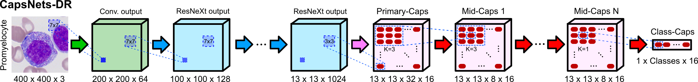
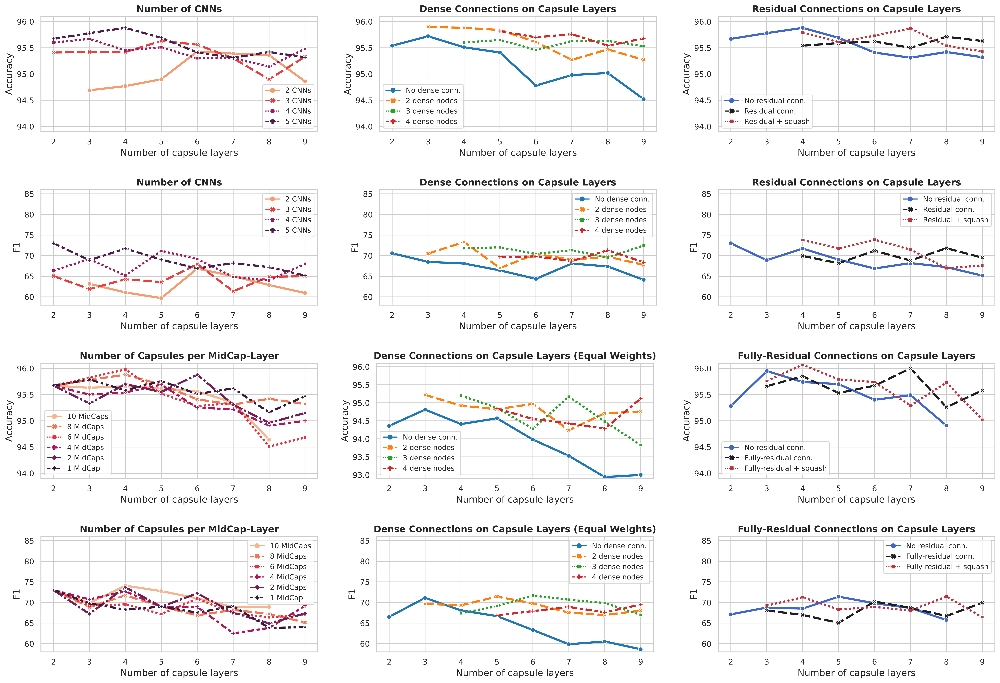

# Deep Convolutional Capsules with Dynamic-Routing (DR-ConvCaps)
#### by Juan P. Vigueras-Guillén et al. (https://www.researchgate.net/profile/Juan-Vigueras-Guillen) 

The paper will be available soon 

&nbsp;

## Abstract
Capsule Networks (CapsNets) is a machine learning architecture proposed to overcome some of the shortcomings of convolutional neural networks (CNNs). The original architecture by [Sabour et al.](https://arxiv.org/abs/1710.09829), which uses a dynamic routing (DR) algorithm, and the following variation by [Hinton et al.](https://openreview.net/pdf?id=HJWLfGWRb), which uses a expectation-maximation (EM) algorithm, have shown good results for digit recognition and small image classification. However, the implementation of Capsnets for the classification of large images has had limited success, particularly for large histopathology images. Furthermore, CapsNets have shown convergence problems when the depth of the capsule section is increased. Our work presents an updated version of CapsNets-DR with several small changes, which provided more stable networks, being possible to increase the depth of the capsule section (up to 9 layers in our experiments). This allowed us to explore the use of residual and dense connections within the capsule section and also the relevance of the number of CNNs before the capsule section. We tested these networks in two public dataset of leukocytes: a set of binary classes (malignant or bening cells, named Leukocyte2, size 450 x 450 px), a set of 15 highly unbalanced classes of leukocytes (named Leukocyte15, size 400 x 400 px). 


## Network Overview

<p align="center">

</p>
<p align="center">
<b>Fig. 1 </b> - Network.
</p>


## Quantitative results on the dataset Leukocyte15

<p align="center">

</p>
<p align="center">
<b>Fig. 2 </b> - Accuracy and F1 for networks with different number of capsule layers based on: <b>(left column)</b> different number of CNNs before the capsule section and different number of capsules within each mid-Capsule; <b>(middle column)</b> different depth of the dense connections by simply adding the dense connections to the baseline networks or by also adding more number of capsules in smaller networks to have a similar number of weights in all networks [equal weights]; and <b>(right column)</b> the use of residual connections, with and without squashing after the residual addition.
</p>


## Getting Started Guide

### Install Required Packages
This repo of code is written for Keras using the TensorFlow backend (ver. 2.4). Please install all required packages before using this code.
```bash
pip install -r requirements.txt
```

### Main File

From the main file (main.py) you can train and test various networks. Simply set the ```--train``` and ```--test``` to 0 or 1 to turn these off or on respectively. There are many more arguments that can be set and these are all explained in the main.py file. 


### Citation

If you use significant portions of our code or ideas from our paper in your research, please cite our work:
```
@article{vigueras2022caps,
  title={In development},
  author={Juan P. Vigueras-Guillén, Ola Engkvist, and Frank Seeliger},
  journal={arXiv preprint ...},
  year={2022}
}
```

### Questions or Comments

Please direct any questions or comments to me; I am happy to help in any way I can. You can email me directly at J.P.ViguerasGuillen@gmail.com

&nbsp;
